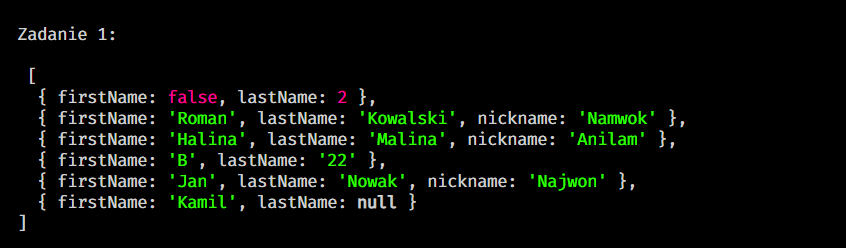
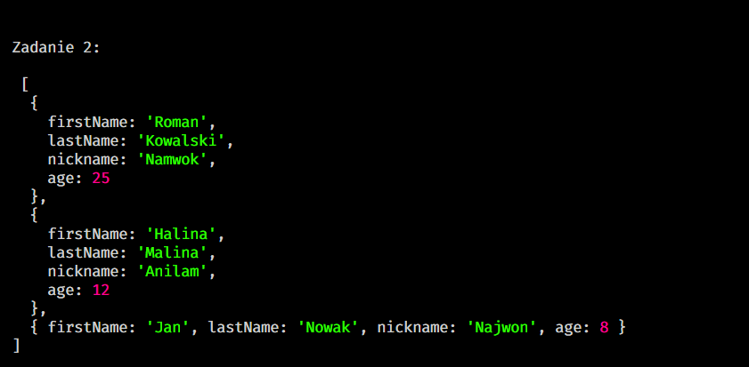
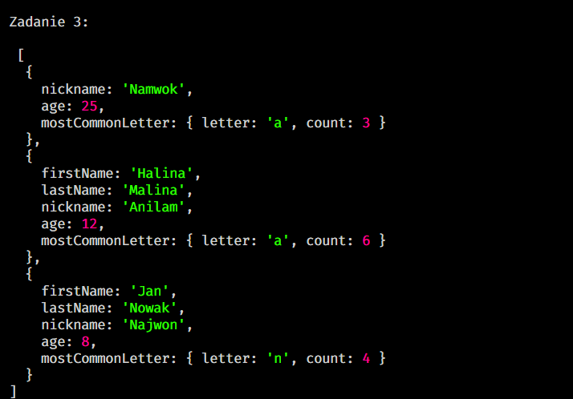

# Sprint 5 - KODUJĄCE KOKOSY


## Zadanie 1

**Treść zadania:**

Napisz funkcję przetwarzającą tablicę obiektów osób. Funkcja powinna generować pseudonim na podstawie określonych zasad i dodawać go do każdego obiektu osoby, gdy jest to możliwe. Nie nadpisuj danych wejściowych.



## Zadanie 2

**Treść zadania:**

Stwórz funkcję, która przetworzy tablicę osób z pierwszego zadania (Należy wykorzystać wynik wywołania funkcji z pierwszego zadania), zwracając tylko osoby, które mają przypisany pseudonim oraz dodając nowe pole age do każdej osoby.



## Zadanie 3

**Treść zadania:**

Stwórz funkcję, która analizuje tablicę osób z drugiego zadania i znajduje najczęściej występującą literę w polach firstName, lastName oraz nickname dla każdej osoby. Wynik powinien zawierać literę i jej liczbę wystąpień, a także określić, co zrobić w przypadku, gdy dwie litery mają tę samą liczbę wystąpień.



### Directory Layout

```
├── /assets/             # Images folder
├── .gitignore           # pliki ignorowane przez git
├── .prettierrc.json     # plik konfiguracyjny Prettier
│── app.js               # JS kod źródłowy
└── README.md            # Ten plik
```

## Uruchomienie

By uruchomić projekt wykonaj następujące kroki w terminalu:

### Sklonuj repo:
```shell
git clone [repository-url]
```
### Przejdź do folderu z repo:
```shell
cd [repository-name]
```
### Uruchom:
```shell
node app.js
```
